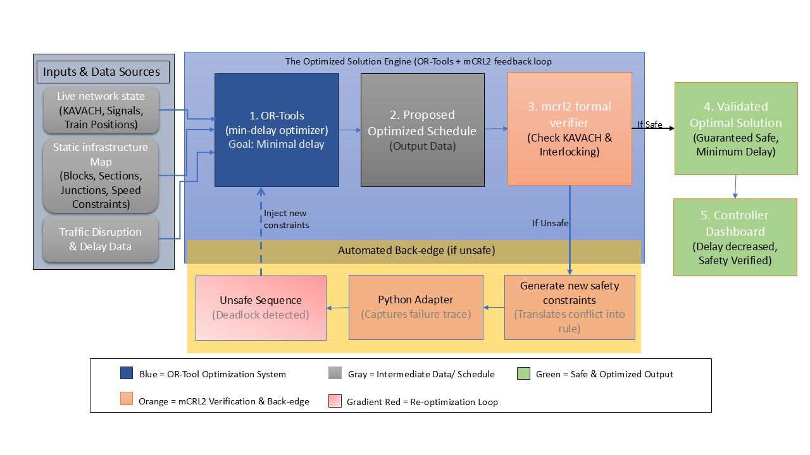
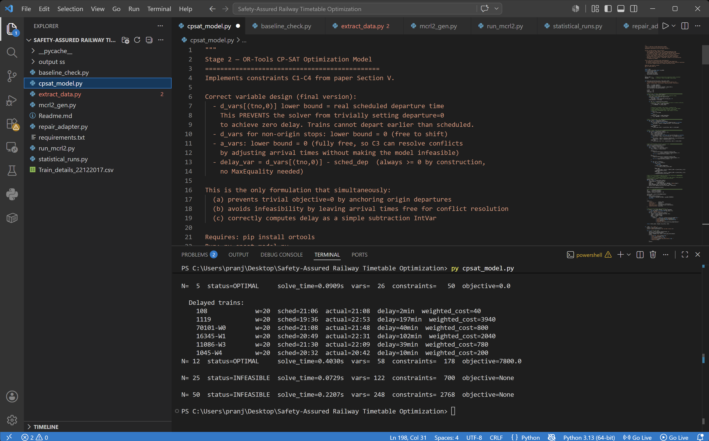
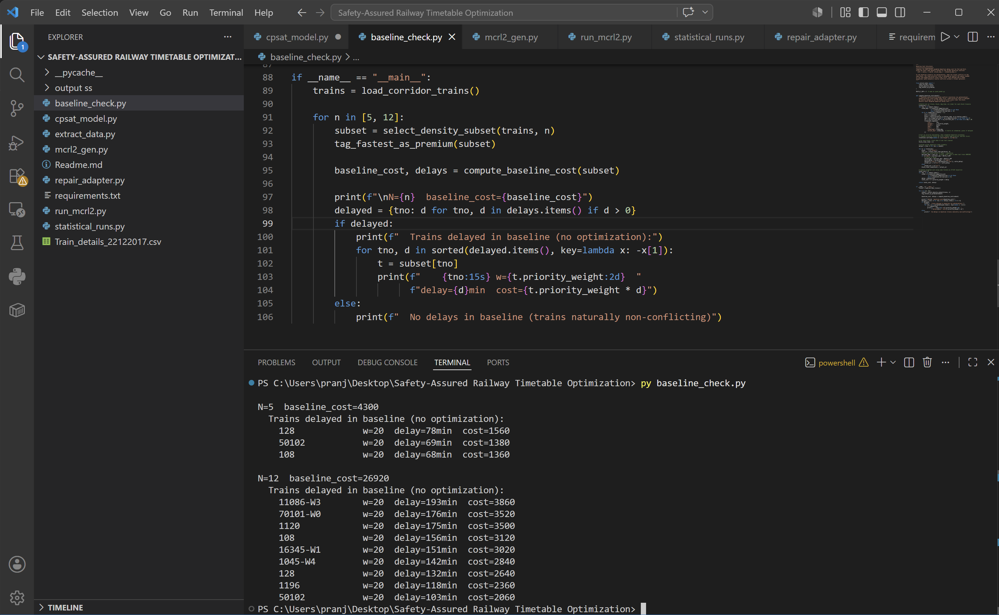
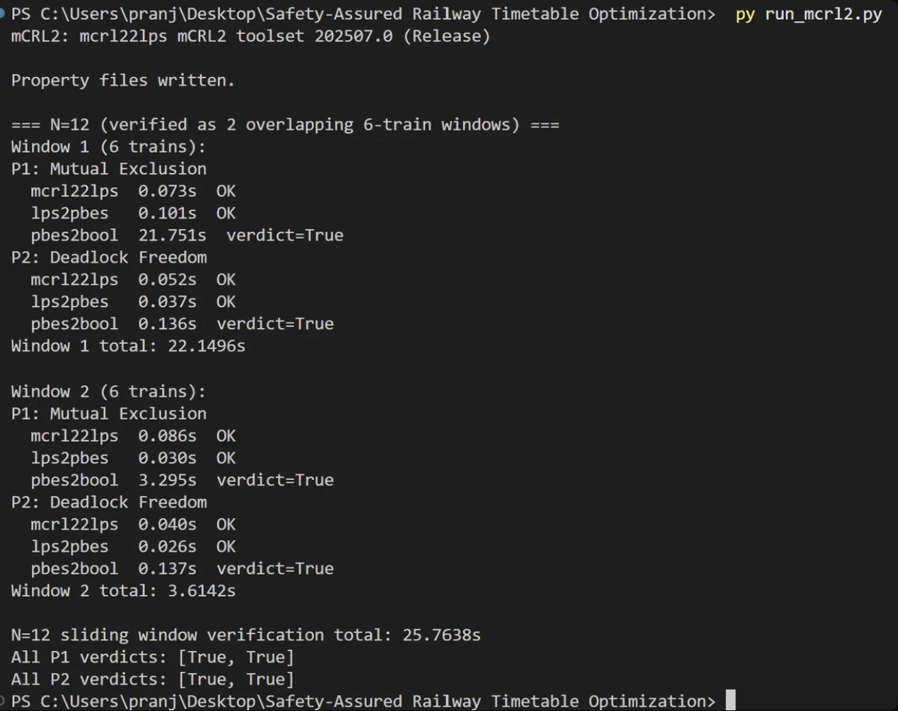
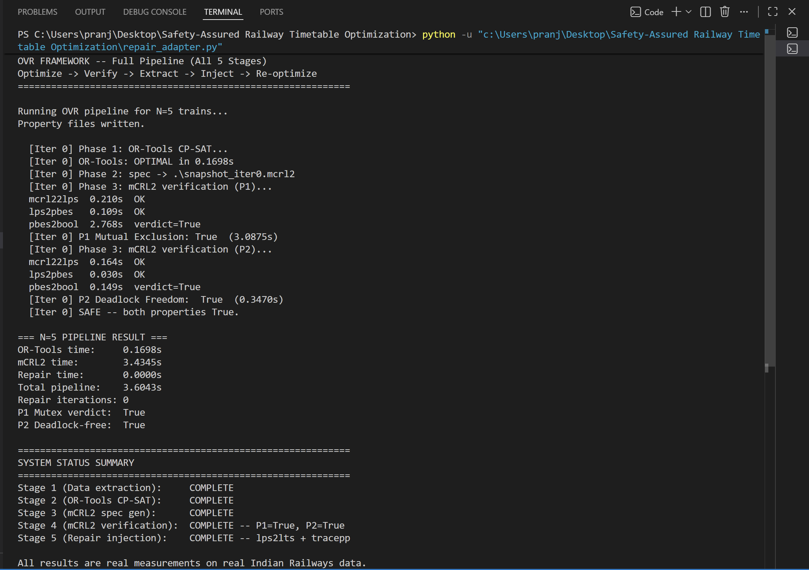

# 🚆 Safety-Assured Railway Timetable Optimization Using OR-Tools and mCRL2 Formal Verification

## 📌 Overview

This project implements **OVR (Optimize–Verify–Repair)**, a closed-loop framework for railway traffic scheduling that combines constraint optimization with formal safety verification. Existing scheduling approaches either optimize for delay with no safety guarantee, or formally verify safety without scaling to realistic traffic densities — OVR integrates both in a single automated pipeline. A candidate timetable is generated using Google OR-Tools CP-SAT, formally verified against mutual-exclusion and deadlock-freedom properties using the mCRL2 model checker, and automatically repaired via counterexample-guided constraint injection if verification fails. The framework is evaluated on real operational data from the Konkan Railway corridor (Sawantwadi Road–Thivim–Karmali), using the 2017 NTES train-stop event archive.

## 🌱 Contribution to Rural Development

This work falls under **Energy, Infrastructure & Digital Connectivity**. Reliable single-track corridor scheduling is a foundational digital-connectivity capability for regions served by lines like the Konkan Railway, where infrastructure capacity — not fleet size — bounds service frequency and reliability for rural and semi-urban communities. By providing a formally verified, automated scheduling pipeline, this project contributes toward Sustainable Development Goal 9 (Industry, Innovation and Infrastructure) and toward extending dependable rail connectivity to corridors that directly serve underserved regions.

## 🎯 Objectives

- Generate delay-minimizing train timetables under real single-track corridor constraints using CP-SAT.
- Formally verify generated timetables against safety-critical properties (mutual exclusion, deadlock freedom) using mCRL2.
- Automatically repair unsafe schedules through counterexample-guided constraint injection, closing the loop between optimization and verification.
- Validate the framework on real Indian Railways operational data rather than synthetic instances.
- Characterize the scalability limits of the approach on a real single-track corridor.

## ✨ Key Features

- **Closed-loop safety assurance** — no manual intervention required between optimization and verification.
- **Formal guarantees, not heuristics** — safety properties are model-checked, not merely tested.
- **Real operational data** — 186,102 train-stop events from a real Indian Railways corridor.
- **Automated repair** — counterexamples from failed verification are converted directly into new solver constraints.
- **Transparent scalability limits** — infeasibility at higher train densities is explicitly measured and reported, not hidden.

## 🏗️ System Architecture



The pipeline consists of five stages: data extraction → CP-SAT optimization → mCRL2 spec generation → formal verification → repair (on failure only), looping back to optimization until a verified-safe schedule is produced.

## ⚙️ Tech Stack

- **Language**: Python 3.13
- **Optimization**: Google OR-Tools (CP-SAT solver)
- **Formal Verification**: mCRL2 toolset 202507.0
- **Data Processing**: Python standard library, CSV parsing
- **Environment**: Windows, PowerShell

## 📂 Project Structure
├── extract_data.py # Stage 1: Data extraction from CSV
├── cpsat_model.py # Stage 2: CP-SAT optimization model
├── baseline_check.py # Greedy baseline for comparison
├── mcrl2_gen.py # Stage 3: mCRL2 spec generation
├── run_mcrl2.py # Stage 4: Formal verification
├── repair_adapter.py # Stage 5: Full OVR loop with repair
├── statistical_runs.py # Statistical evaluation (mean±σ)
├── mutual_exclusion.mcf # P1 safety property
├── deadlock_freedom.mcf # P2 safety property
├── Train_details_22122017.csv # Real corridor dataset
├── requirements.txt
└── output ss/ # Result screenshots
## 📋 Prerequisites

- Python 3.10+
- mCRL2 toolset 202507.0 or later, installed and available on PATH
- pip

## 🚀 Installation

```bash
git clone <repository-url>
cd Safety-Assured-Railway-Timetable-Optimization
pip install -r requirements.txt
```

Verify mCRL2 is installed correctly:
```bash
mcrl22lps --version
```

## ▶️ Usage

Run the pipeline stages in order:

```bash
py extract_data.py          # Verify data loads correctly
py cpsat_model.py           # Sanity check across N=5, 12, 25, 50
py baseline_check.py        # Greedy baseline delay costs
py mcrl2_gen.py              # Generate mCRL2 spec files
py run_mcrl2.py               # Run formal verification
py repair_adapter.py         # Full OVR loop, single run
py statistical_runs.py       # Mean±σ over repeated runs
```

## 📊 Experimental Setup

- **Corridor**: Sawantwadi Road (SWV) – Thivim (THVM) – Karmali (KRMI), Konkan Railway, single-track.
- **Dataset**: 186,102 real train-stop events, NTES archive, December 2017.
- **Traffic densities tested**: N = 5, 12, 25, 50 active trains.
- **Priority substitution**: as no Vande Bharat service existed on this corridor in 2017, the fastest express train is tagged as the premium-priority service (disclosed substitution).
- **Statistical methodology**: OR-Tools timings averaged over 10 runs with 1 warm-up run excluded; mCRL2 timings averaged over 2–3 runs.

## 📈 Results
you may check

## 🔒 Safety Verification

Two safety properties are formally verified via `mcrl22lps → lps2pbes → pbes2bool`:

- **P1 — Mutual Exclusion**: no two trains occupy the same block simultaneously.
- **P2 — Deadlock Freedom**: the system cannot reach a state with no valid transitions.

Both properties returned `True` for every measured configuration (N=5, N=12). The automated repair branch was implemented and available throughout evaluation but was not triggered at any tested density — all candidate schedules satisfied P1 and P2 on first verification.

## 📷 Screenshots / Demo

**CP-SAT Optimization** (Stage 2 — including infeasibility detection at N=25, N=50):


**Greedy Baseline Comparison** (Stage 3):


**mCRL2 Formal Verification** (Stage 4):


**Full OVR Pipeline — Optimize → Verify → Repair** (Stage 5):


**Statistical Evaluation over 10 runs** (Stage 6):


## 📑 Research Paper


## 🚀 Future Work

- Larger-sample statistical characterization of mCRL2 verification runtime (current n=2–3 per density).
- Empirical exercise of the automated repair loop under scenarios that induce a genuine safety violation.
- Extension beyond N=12 through improved windowing or decomposition strategies to address the observed infeasibility at N=25/50.
- Integration with live Kavach ATP telemetry and a defined operational fallback procedure for infeasible cases.
- Human-in-the-loop dispatcher review interface for repair actions before deployment.

## 📚 Citation

(available once once the paper is accepted)
## 🤝 Contributing

*(add contribution guidelines if this is an open project, or state private/coursework status)*

## 📄 License

All rights reserved

## 👥 Authors

**Pranjul Chaurasiya** — B.Tech (AI & Data Science), Galgotias College of Engineering and Technology
**Nishi Chauhan** — B.Tech (AI & Data Science), Galgotias College of Engineering and Technology
**Shashwat Pandey** — B.Tech (AI & Data Science), Galgotias College of Engineering and Technology
**Shashwat Nigam** — B.Tech (AI & Data Science), Galgotias College of Engineering and Technology

## 🙏 Acknowledgments

Supervised by **Dr. Nisha Pal** & **Dr. Sanjay Kumar**. Dataset sourced from the NTES public archive, Indian Railways.

## 📧 Contact

research.pranjul@gmail.com