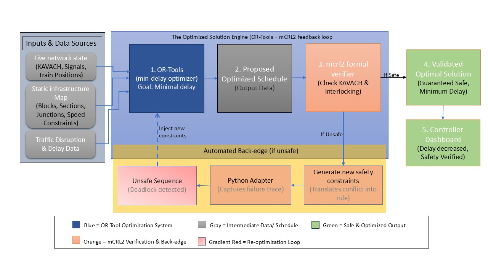
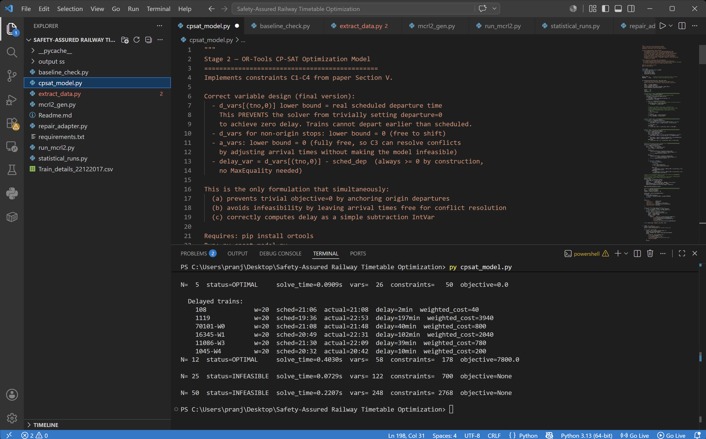
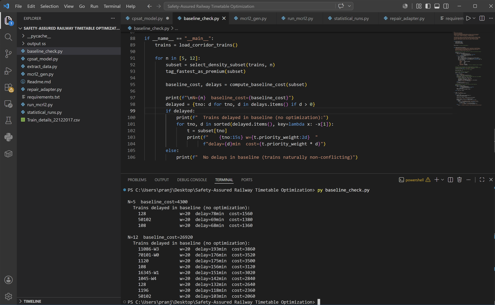
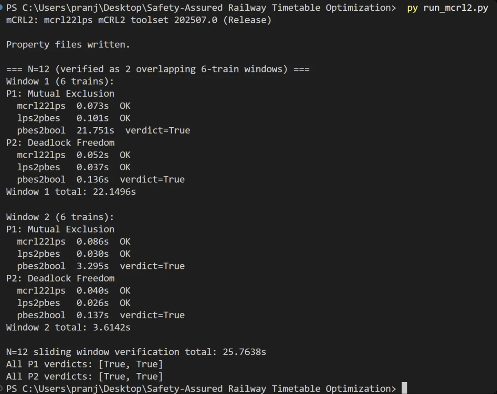
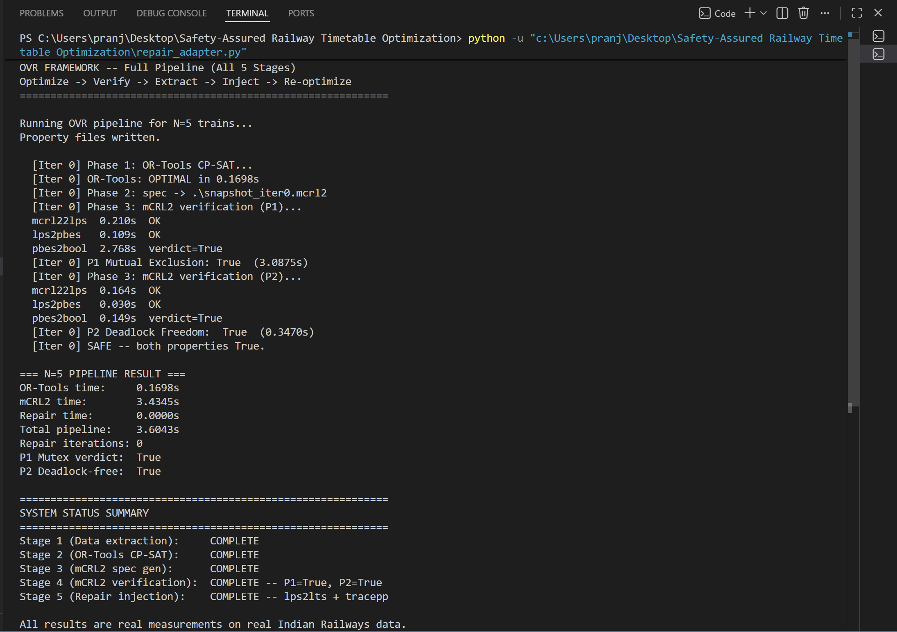
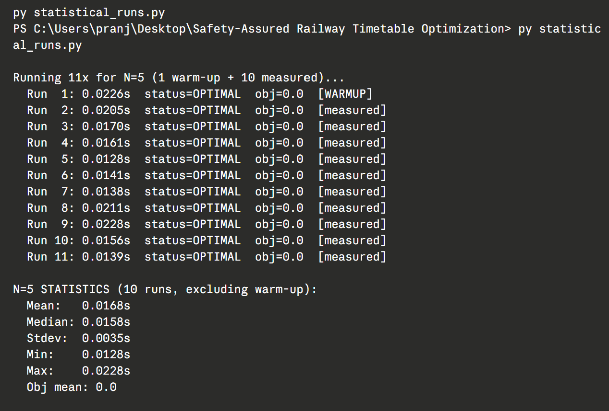
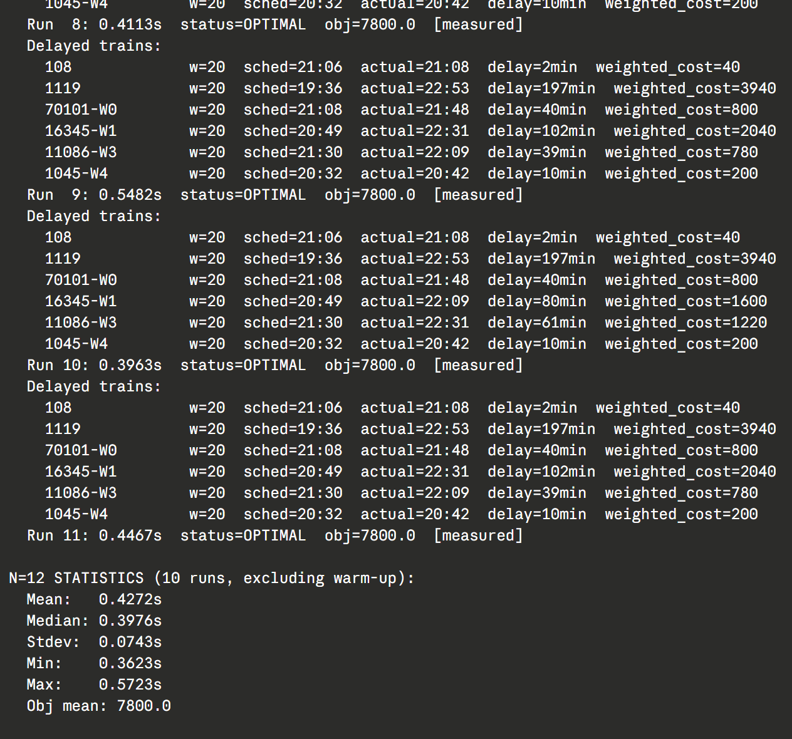

# Railway Timetable Optimization and mCRL2 Process Checking

## 📌 Overview

This repository is an Optimize–Verify prototype with a prepared repair adapter. OR-Tools CP-SAT optimizes priority-weighted departure delay. A separate, untimed mCRL2 model checks train route order and block-resource behavior. It does not encode the optimized arrival/departure times, so its verdicts do not formally verify the candidate timetable. Repair feedback is not yet consumed by CP-SAT.

## 🌱 Contribution to Rural Development

This prototype studies scheduling and process-model verification on a short Konkan Railway corridor. It is research software, not an operational railway control or safety system.

## 🎯 Objectives

- Generate delay-minimizing train timetables under real single-track corridor constraints using CP-SAT.
- Check block-grant mutual exclusion and premature deadlock in the untimed mCRL2 process model.
- Develop a future connection between verified counterexamples, temporal repair constraints, and CP-SAT.
- Validate the framework on real Indian Railways operational data rather than synthetic instances.
- Characterize the scalability limits of the approach on a real single-track corridor.

## ✨ Key Features

- **Separate optimization and process checking** — the process model is currently untimed.
- **Meaningful process properties** — P1 forbids a second block grant before release; P2 forbids deadlock before every train finishes.
- **Real timetable archive** — 186,124 train-stop records in the source CSV.
- **Prepared repair adapter** — diagnostic feedback is not yet used by the solver.
- **Constructed stress cases** — infeasibility at N=25 and N=50 is specific to the tested synthetic density instances and model, not a corridor capacity theorem.

## 🏗️ System Architecture



The executable path is data extraction → CP-SAT optimization → mCRL2 process generation → process-property checking. The adapter may record feedback on failure; it does not establish a repaired timetable.

## ⚙️ Tech Stack

- **Language**: Python 3.13
- **Optimization**: Google OR-Tools (CP-SAT solver)
- **Formal Verification**: mCRL2 toolset 202507.0
- **Data Processing**: Python standard library, CSV parsing
- **Environment**: Windows, PowerShell

## 📂 Project Structure
├── extract_data.py # Stage 1: Data extraction from CSV
├── cpsat_model.py # Stage 2: CP-SAT optimization model
├── baseline_check.py # Greedy baseline for comparison
├── mcrl2_gen.py # Stage 3: mCRL2 spec generation
├── run_mcrl2.py # Stage 4: Formal verification
├── repair_adapter.py # Prepared repair feedback (not a closed loop)
├── statistical_runs.py # Statistical evaluation (mean±σ)
├── mutual_exclusion.mcf # P1 safety property
├── deadlock_freedom.mcf # P2 safety property
├── Train_details_22122017.csv # Real corridor dataset
├── requirements.txt
└── output ss/ # Result screenshots
## 📋 Prerequisites

- Python 3.10+
- mCRL2 toolset 202507.0 or later, installed and available on PATH
- pip

## 🚀 Installation

```bash
git clone <repository-url>
cd Safety-Assured-Railway-Timetable-Optimization
pip install -r requirements.txt
```

Verify mCRL2 is installed correctly:
```bash
mcrl22lps --version
```

## ▶️ Usage

Run the pipeline stages in order:

```bash
py extract_data.py          # Verify data loads correctly
py cpsat_model.py           # Sanity check across N=5, 12, 25, 50
py baseline_check.py        # Greedy baseline delay costs
py mcrl2_gen.py              # Generate mCRL2 spec files
py run_mcrl2.py               # Run formal verification
py repair_adapter.py         # Full OVR loop, single run
py statistical_runs.py       # Mean±σ over repeated runs
```

## 📊 Experimental Setup

- **Corridor**: Sawantwadi Road (SWV) – Thivim (THVM) – Karmali (KRMI), Konkan Railway, single-track.
- **Dataset**: 186,124 train-stop records in the CSV, NTES archive, December 2017.
- **Traffic densities tested**: N = 5, 12, 25, 50 active trains.
- **Priority substitution**: as no Vande Bharat service existed on this corridor in 2017, the fastest express train is tagged as the premium-priority service (disclosed substitution).
- **Statistical methodology**: `statistical_runs.py` reports OR-Tools timings over 10 runs after one warm-up. mCRL2 timings require a separate repeated-run measurement; the current verifier prints single-run timings.

## 📈 Results
you may check

## 🔒 Safety Verification

Two properties of the untimed process model are checked via `mcrl22lps → lps2pbes → pbes2bool`:

- **P1 — Block-grant mutual exclusion**: a block cannot be granted again before its free action.
- **P2 — No premature deadlock**: a state with no valid transition is allowed only after every train finishes.

The N=12 check uses two disjoint six-train partitions. Cross-partition interactions are not verified. Earlier reported verdicts used ineffective formulas; rerun the scripts for current verdicts and timings. A True verdict does not establish timetable timing correctness or operational safety.

## 📷 Screenshots / Demo

These screenshots were captured before the property and baseline corrections. Re-run the scripts for current results; do not cite the screenshots as current measurements.

**CP-SAT Optimization** (Stage 2 — including infeasibility detection at N=25, N=50):


**Greedy Baseline Comparison** (Stage 3):



**mCRL2 Formal Verification** (Stage 4):


**Full OVR Pipeline — Optimize → Verify → Repair** (Stage 5):


**Statistical Evaluation over 10 runs** (Stage 6):


## 📑 Research Paper


## 🚀 Future Work

- Larger-sample statistical characterization of mCRL2 verification runtime (current n=2–3 per density).
- Empirical exercise of the automated repair loop under scenarios that induce a genuine safety violation.
- Extension beyond N=12 through improved windowing or decomposition strategies to address the observed infeasibility at N=25/50.
- Integration with live Kavach ATP telemetry and a defined operational fallback procedure for infeasible cases.
- Human-in-the-loop dispatcher review interface for repair actions before deployment.

## 📚 Citation

(available once once the paper is accepted)
## 🤝 Contributing

*(add contribution guidelines if this is an open project, or state private/coursework status)*

## 📄 License

All rights reserved

## 👥 Authors

**Pranjul Chaurasiya** — B.Tech (AI & Data Science), Galgotias College of Engineering and Technology
**Nishi Chauhan** — B.Tech (AI & Data Science), Galgotias College of Engineering and Technology
**Shashwat Pandey** — B.Tech (AI & Data Science), Galgotias College of Engineering and Technology
**Shashwat Nigam** — B.Tech (AI & Data Science), Galgotias College of Engineering and Technology

## 🙏 Acknowledgments

Supervised by **Dr. Nisha Pal** & **Dr. Sanjay Kumar**. Dataset sourced from the NTES public archive, Indian Railways.

## 📧 Contact

research.pranjul@gmail.com
